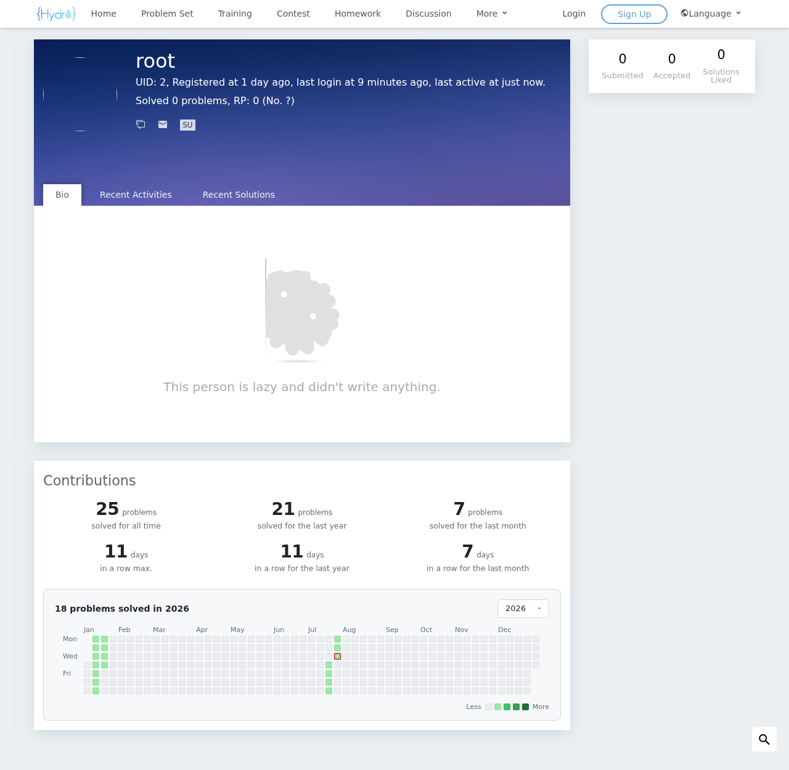
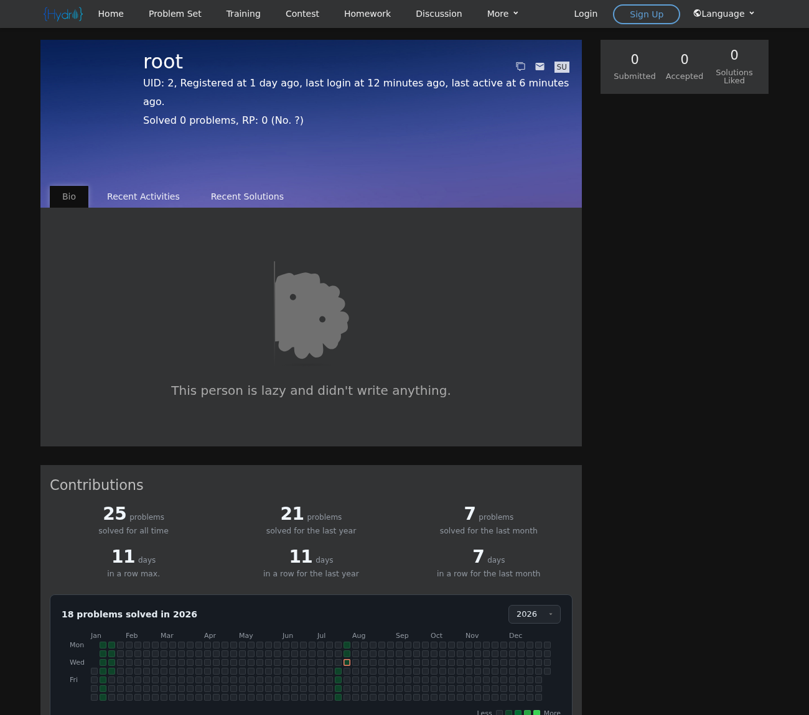

# @hydrooj/contribution-graph

为 HydroOJ 用户主页添加一个类似 **Codeforces 的贡献图（contribution graph）**，
直接展示在每个用户的个人主页（`/user/:uid`）上。

<p>
  
</p>
<p>
  
</p>

## 功能

以卡片形式展示在个人主页下方，包含一张可按年份查看的每日解题热力图（带年份下拉选择），
以及六项与 Codeforces 一致的统计数据：

- 历史累计解题数
- 最近一年解题数
- 最近一月解题数
- 最长连续解题天数
- 最近一年最长连续天数
- 最近一月最长连续天数

其中「解题」按**去重后的题目**计算：同一道题只在其**首次通过（AC）**的那天计入一次。

热力图会自动缩放以适应卡片宽度（不出现横向滚动条），并完整适配 ui-default 的浅色与深色主题。

## 安装

```bash
hydrooj addon add /绝对路径/hydro-contribution-graph
pm2 restart hydrooj    # 或使用你自己的方式重启 hydrooj
```

也可以直接在 HydroOJ 所在主机上运行 `./deploy.sh`。

无需构建步骤：HydroOJ 会在加载时自动转译 `index.ts`，并自动发现 `templates/`。

## 配置（可选）

通过控制面板 / `SystemModel` 设置：

- `contribution.timezone` —— 用于按天分组的时区，默认 `Asia/Shanghai`。
- `contribution.cacheTtl` —— 统计缓存的有效期（毫秒），默认 `600000`。

## 许可证

AGPL-3.0-or-later.
